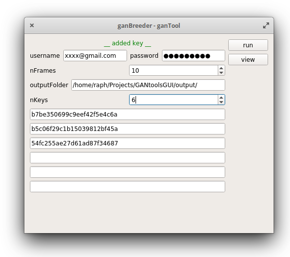

# gantoolsGUI
This python program provides a crude interface for [Vee9ahd1's GANtools](https://gitlab.com/Vee9ahd1/gantools) and [Ganbreeder](https://ganbreeder.app/)

## requirements

- Linux
	- ffmpeg (for building the movie)
	- mpv (for showing the movie)
- python3
	- tensorflow (bigGAN)
	- gantools (sampling)
	- pyqt (GUI)

## example

Fill in the text fields. In the empty bars you should paste your keys.

In the .py file, you can set your default username and password under `setUserSettings()`.

The bigGAN might take a while to load. GL!
